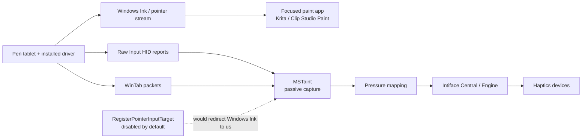

# MSTaint

MSTaint is a C#/.NET tray utility prototype for controlling Buttplug devices from pen tablet telemetry.

The current version targets Windows, connects to an external Intiface Central/Engine instance over WebSocket, and maps pen pressure to vibration intensity. The core mapping and safety logic is cross-platform and covered by tests; Win32 pen capture needs to be tested on Windows hardware.

## Build

```powershell
dotnet build MSTaint.slnx
dotnet test tests/MSTaint.Core.Tests/MSTaint.Core.Tests.csproj
```

## Installer

The Inno Setup installer packages the Release publish output from `artifacts/publish/MSTaint` and installs to `C:\Program Files\MSTaint`.

```powershell
dotnet publish src/MSTaint/MSTaint.csproj -c Release -f net10.0-windows -r win-x64 --self-contained false -o artifacts/publish/MSTaint
& "$env:LOCALAPPDATA\Programs\Inno Setup 6\ISCC.exe" installer/MSTaint.iss
```

The installer output is written to `artifacts/installer/MSTaintSetup.exe`.

## Distribution And Signing

_AKA Why you probably shouldn't try to fork and build this yourself unless you want to deal with a ton of bullshit._

Distribution builds require code signing. The app manifest currently sets `uiAccess="true"`, and Windows only grants UIAccess to signed binaries installed from a trusted location such as Program Files. For release builds, sign the published app binaries before compiling the installer, then sign the installer itself.

Unsigned local builds are still useful for development and diagnostics, but they are not suitable for packaged distribution and should not be expected to behave the same as the signed Program Files install.

The Forgejo Windows workflow expects these signing secrets, matching the token-backed SignTool setup used by other Intiface Windows builds:

- `WINDOWS_CODESIGN_CERT_BASE64`
- `WINDOWS_CODESIGN_KEY_CONTAINER`
- `WINDOWS_CODESIGN_TOKEN_PASSWORD`
- `WINDOWS_CODESIGN_CSP` (optional, defaults to `eToken Base Cryptographic Provider`)
- `WINDOWS_CODESIGN_TIMESTAMP_URL` (optional, defaults to `http://timestamp.digicert.com`)

## Run On Windows

1. Start Intiface Central or Intiface Engine with the WebSocket server listening on `ws://127.0.0.1:12345`.
2. Run `src/MSTaint`.
3. Open the settings window from the tray menu or by double-clicking the tray icon. The settings window and tray menu can both connect Intiface, scan for devices, arm/disarm output, open the pen test window, or trigger emergency stop.

## Paint Program Setup

Set paint programs to use Windows Ink, Windows 8+ Pointer Input, or the program's equivalent modern pointer input mode for tablet pressure. MSTaint's current capture model is designed around the paint program keeping its own Windows Ink stream while MSTaint listens passively to driver-exposed Raw Input HID or WinTab pressure samples.

Do not configure paint programs to require an exclusive WinTab stream if pressure stops reaching MSTaint or the paint program while the canvas is focused.

**HOW TO TELL IF YOU ARE ON THE WRONG API**: If your paint program seems to only have off/on versus varying pressure, this usually means it is set to WinTab instead of Windows Ink. If you are using a program that cannot set to Windows Ink, please leave an issue here and we'll consider rebuilding this as a mod instead of a tee-style watcher, which should work with all systems. However, that solution may be brittle, see `Possible WinTab Injection Path` below.

### Specific Paint Program Instructions

- Krita: use the Windows Ink/Windows 8+ pointer tablet input mode (in Settings)
- Clip Studio Paint: use Tablet PC/Windows Ink path when available (in Settings)
- Fire Alpaca: Use "Tablet PC" in "Stylus Pressure API", even if on PC + Tablet
- MyPaint: Currently not usable.

## Capture Notes

The app starts a hidden capture window and enables passive capture paths:

- Raw Input with a background digitizer HID sink for installed tablet drivers that route paint apps through driver APIs such as WinTab.
- A minimal WinTab pressure context for driver stacks where Krita/other paint programs stop mirroring usable pressure through Windows pointer or HID reports.

The working split is not a single Windows Ink queue that MSTaint receives and replays. The focused drawing app keeps its own Windows Ink/pointer stream, while MSTaint listens to passive driver-exposed streams and maps those pressure samples to Intiface:



The Raw Input path reads HID `Tip Pressure` reports and normalizes each device's logical pressure range into the existing `0..1024` pressure model. The WinTab path opens the default system context and requests only `X`, `Y`, `BUTTONS`, and `NORMAL_PRESSURE`. The capture service also gates samples by active input source so a zero-pressure or pen-up packet from one source cannot immediately stop output driven by pressure packets from another source.

`RegisterPointerInputTarget` is intentionally disabled by default because it redirects all pen pointer input to this app instead of teeing it; that breaks Windows Ink pressure in focused drawing apps such as Krita or Clip Studio Paint. For diagnostics only, set `WPC_ENABLE_POINTER_REDIRECT=1` before launching the app to enable Windows pointer redirection.

Keep the drawing app on its Windows Ink pressure API, such as Windows Ink/Windows 8+ Pointer Input for Krita. MSTaint should receive pressure from the passive Raw HID or WinTab paths while the focused drawing app receives its own pressure stream.

Raw Input registration should work without UIAccess. If passive global paths fail, use the pen test window to validate local `WM_POINTER*` pressure/tilt/button telemetry.

The manifest currently sets `uiAccess="true"`, so release binaries must be signed and installed from a trusted location such as Program Files.

## Possible WinTab Injection Path

If Windows Ink compatibility is not enough for a target workflow, a future WinTab-specific tee could use the same general model as `intiface-game-haptics-router`: inject a small payload into the focused paint process with EasyHook, hook only the WinTab functions that expose context and queue reads, and report copied pressure samples back to MSTaint over IPC.

This avoids shipping a proxy `wintab32.dll` and avoids recreating the full WinTab export surface. The paint program would still load the real tablet driver `wintab32.dll`; the injected payload would detour selected functions in-process:

- `WTOpenA/W` to record each `HCTX` and its requested `LOGCONTEXT`.
- `WTClose` to discard context state.
- `WTPacket`, `WTPacketsGet`, `WTDataGet`, and `WTDataPeek` to copy packets after the real WinTab call returns.
- `WTInfoA/W` to query pressure axis metadata and logical ranges when needed.

The hook must not independently read from the WinTab queue. It should forward to the real function first, let the paint app receive its packets unchanged, then copy the returned packet data into a local queue. A payload loop can batch those samples back to MSTaint, keeping IPC work out of the paint app's input thread.

The hard part is still generic packet decoding. WinTab packet layout depends on the `LOGCONTEXT.lcPktData` requested by each app, so the payload needs per-context decoding logic rather than assuming a fixed packet structure. Supporting both 32-bit and 64-bit paint apps would also require matching hook payload builds.

## LLM Usage

Since this is made to be used with paint programs, development methods bear mentioning as many potential users may see this as a showstopper.

While this project is derived from a project I originaly wrote and never released ('cause it never worked enough for me to want to deal with the support on it), this implementation uses GPT-5.5 w/ GLM-5.2 review to patch some of the issues I was having and handle a lot of the P/Invoke reworking and Win32 drudgery (I was writing win32 in the 90s and am officially too old for that shit).

If this implementation method bothers you, do not use this program. If you would like to reimplement it yourself, see the above Injection Path idea and create a project the good ol' open source way, by copying the BSD-Licensed GHR code I wrote by hand.

## License

MSTaint is BSD 3-Clause licensed.

Copyright (c) 2026, Nonpolynomial, LLC
All rights reserved.

Redistribution and use in source and binary forms, with or without
modification, are permitted provided that the following conditions are met:

* Redistributions of source code must retain the above copyright notice, this
  list of conditions and the following disclaimer.

* Redistributions in binary form must reproduce the above copyright notice,
  this list of conditions and the following disclaimer in the documentation
  and/or other materials provided with the distribution.

* Neither the name of buttplug nor the names of its
  contributors may be used to endorse or promote products derived from
  this software without specific prior written permission.

THIS SOFTWARE IS PROVIDED BY THE COPYRIGHT HOLDERS AND CONTRIBUTORS "AS IS"
AND ANY EXPRESS OR IMPLIED WARRANTIES, INCLUDING, BUT NOT LIMITED TO, THE
IMPLIED WARRANTIES OF MERCHANTABILITY AND FITNESS FOR A PARTICULAR PURPOSE ARE
DISCLAIMED. IN NO EVENT SHALL THE COPYRIGHT HOLDER OR CONTRIBUTORS BE LIABLE
FOR ANY DIRECT, INDIRECT, INCIDENTAL, SPECIAL, EXEMPLARY, OR CONSEQUENTIAL
DAMAGES (INCLUDING, BUT NOT LIMITED TO, PROCUREMENT OF SUBSTITUTE GOODS OR
SERVICES; LOSS OF USE, DATA, OR PROFITS; OR BUSINESS INTERRUPTION) HOWEVER
CAUSED AND ON ANY THEORY OF LIABILITY, WHETHER IN CONTRACT, STRICT LIABILITY,
OR TORT (INCLUDING NEGLIGENCE OR OTHERWISE) ARISING IN ANY WAY OUT OF THE USE
OF THIS SOFTWARE, EVEN IF ADVISED OF THE POSSIBILITY OF SUCH DAMAGE.

